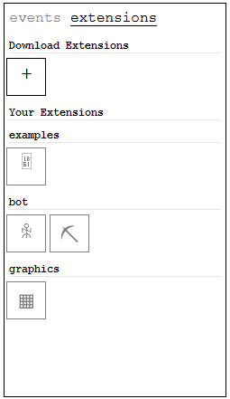

# Sprint
An easy to use client to download and create extensions for the game [thetravelers](https://thetravelers.online).

## This Project is Still in Development
Sprint is still early in development and might break your game and/or steal your credit card info.

### What is Sprint
Sprint, gives you easy access to a large assortment of mods, bots, texture packs, and any other extra content for the game in the form of 'extensions'.

**Adds easy to install extensions to your game**



**Makes creating extensions super easy**
```js
// Make an auto sprint bot with only 4 lines of code
import Extension from "../../extension.js"

const extension = new Extension({ id: "autoSprint", name: "Auto Sprint" });

extension.onUpdate((client) => { client.travler.sprint() });

export default extension;
```

### How to Install
1. Copy the contents of this [file](install.js).
2. Paste it into the console once you are logged in the game.

#### Making Extensions
A guide on making extensions as well as Sprint documentation can be found [here](extensions/ExtensionGuide.md).
You can also see examples of existing extensions in the extensions directory.